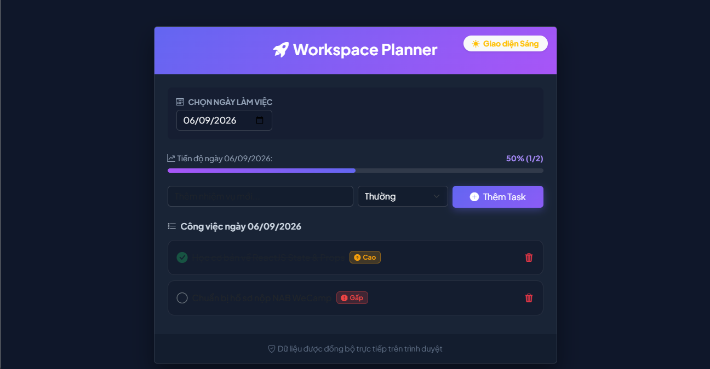

# ⚡ Workspace Planner & Task Management App

Ứng dụng quản lý công việc cá nhân phân loại theo từng ngày (Calendar View), hỗ trợ tính năng chọn mức độ ưu tiên, thanh theo dõi tiến độ hoàn thành và tự động đẩy thông báo hai chiều (Tạo mới & Hoàn thành) về ứng dụng Telegram qua **Telegram Bot API**.

---

## 🌟 Tính năng nổi bật

* 📅 **Quản lý theo Lịch (Calendar View):** Phân loại danh sách công việc riêng biệt theo từng ngày, không bị dồn nén giao diện.
* 🔥 **Phân loại ưu tiên:** Đánh dấu mức độ quan trọng (*Gấp*, *Cao*, *Thường*) đi kèm icon trực quan.
* 📊 **Thanh tiến độ (Progress Bar):** Tính toán và hiển thị % hoàn thành công việc trong ngày theo thời gian thực.
* 🔔 **Tích hợp Telegram Bot API:**
  * Tự động gửi thông báo khi tạo nhiệm vụ mới kèm thông tin chi tiết.
  * Tự động gửi tin nhắn chúc mừng khi đánh dấu hoàn thành nhiệm vụ.
* 🌗 **Chế độ Sáng / Tối (Dark/Light Mode):** Hỗ trợ 2 bộ giao diện Tối Neon và Sáng (Cam/Trắng) linh hoạt.
* 💾 **Đồng bộ Dữ liệu:** Tự động lưu và duy trì dữ liệu người dùng qua Browser `LocalStorage`.
## 📸 Giao diện ứng dụng

(./public/assets/image.png)

---

## 🛠️ Công nghệ sử dụng

* **Front-end Framework:** ReactJS (ES6+)
* **State Management:** React Hooks (`useState`, `useEffect`)
* **UI & Styling:** Bootstrap 5, Bootstrap Icons, Custom CSS (Glassmorphism & Neon theme)
* **API Integration:** Telegram Bot API via `fetch` API (`Async/Await`)
* **Storage:** LocalStorage API

---

## 🚀 Hướng dẫn chạy dự án ở máy cục bộ (Local Setup)

### Yêu cầu
* Node.js (phiên bản 16.x trở lên)
* npm hoặc yarn

### Các bước thực hiện

1. **Clone repository về máy:**
   ```bash
   git clone [https://github.com/inettee/react-task-manager.git](https://github.com/inettee/react-task-manager.git)
   cd react-task-manager
    a.    Cài đặt các gói phụ thuộc (Dependencies):
        npm install
    b. Khởi chạy ứng dụng ở môi trường Development:
        npm start